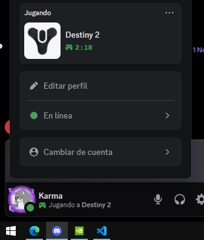
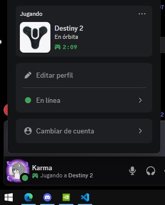
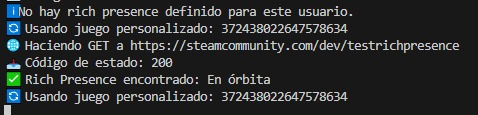

# 🎮 Discord Rich Presence for GeForce NOW






A **custom Discord Rich Presence** tool that shows the game you are running on **GeForce NOW**, with support for:
- Automatically changing the Discord `client_id` based on the detected game.
- Optional Steam scraping to display detailed rich presence status.
- Automatic translation of the presence text.
- External configuration via `.env` and `games_config.json`.
- Works silently in the background.

---

## 🚀 Features

- ✅ **Accurate GeForce NOW detection** (no false positives from browser tabs).
- 🔄 **Dynamic `client_id` switching** per game.
- 🌍 **Automatic translation** using Google Translate.
- 🔐 **Optional Steam scraping** for detailed status.
- 📁 **External configuration** for easy customization.
- 🛡 **No-scraping mode** if you don’t provide a Steam cookie.

---

## 📦 Installation

### 1. Clone the repository
```bash
git clone https://github.com/KarmaDevz/discord-rich-presence-geforcenow.git
cd discord-rich-presence-geforcenow
```

### 2. Create and activate a virtual environment
```bash
python -m venv venv
.env\Scriptsctivate
```

### 3. Install the dependencies
```bash
pip install -r requirements.txt
```

### 4. Configure the `.env` file
Create a file named `.env` in the project root with:
```env
CLIENT_ID=123456789012345678
TEST_RICH_URL=https://steamcommunity.com/minigame/status/...
STEAM_COOKIE=your_steamLoginSecure_cookie
CONFIG_PATH_FILE=config_path.txt
```

### 5. Add your `games_config.json` (You can also use my own file `config/games_config.json`)
Example:
```json
{
  "Apex Legends": {
    "name": "Apex Legends",
    "client_id": "123456789012345678",
    "steam_appid": "1172470",
  }
}
```

---

## ▶️ Usage

1. Start GeForce NOW.
2. Run:
```bash
python src/geforce.py
```
3. Your Discord status will automatically update with the current game.

---

## ⚙️ Game configuration

The `games_config.json` file defines games, images, and `client_id` values.

**Fields:**
- `name`: Display name for Discord Rich Presence.
- `image`: Key for the large image asset in Discord Developer Portal.
- `client_id`: Discord application ID.
- `steam_appid`: (Optional) Steam AppID for rich presence scraping.
- `icon_key`: (Optional) Small image key for the icon.

---

## 📜 License

This project is licensed under the [MIT License](LICENSE).

---

## ⚠️ Legal Disclaimer

This project is **unofficial** and **not affiliated, endorsed, or sponsored** by:
- NVIDIA Corporation (GeForce NOW)
- Valve Corporation (Steam)
- Discord Inc.

All trademarks and logos are property of their respective owners.  
Use of this tool is subject to the terms of service of:
- [Discord Developer Terms of Service](https://discord.com/developers/docs/legal)
- [Steam Subscriber Agreement](https://store.steampowered.com/subscriber_agreement/)
- [NVIDIA Terms of Use](https://www.nvidia.com/en-us/about-nvidia/legal-info/)

The developer of this project **is not responsible** for misuse.

---

## 🤝 Contributing

Contributions are welcome!  
Fork the repository, create a branch, make your changes, and submit a pull request.

---

## 💬 Credits

- [pypresence](https://qwertyquerty.github.io/pypresence/) – Discord Rich Presence integration
- [BeautifulSoup](https://www.crummy.com/software/BeautifulSoup/) – HTML parsing
- [deep-translator](https://pypi.org/project/deep-translator/) – Automatic translation
